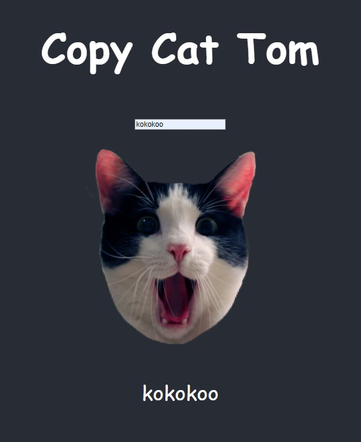

# Copy Cat(Testing)

## Table of contents

- [Overview](#overview)
  - [The challenge](#the-challenge)
  - [Screenshot](#screenshot)
  - [Links](#links)
- [My process](#my-process)
  - [Built with](#built-with)
  - [What I learned](#what-i-learned)
  - [Continued development](#continued-development)
- [Author](#author)

## Overview

### The challenge

Users should be able to:

- View the optimal layout for the app depending on their device's screen size
- Enter text in the input area.
- Below face, the input will be copied simultaneously.
- Click on cat, mimicked text will be hidden and tap will cover cats mouth
- In Node.js, run `npm test` and see the test pass.

### Screenshot

### Links

- Live Site URL: [View](https://copycattest.netlify.app/)

## My process

- First, you need to import the required modules and methods: React for JSX syntax, `render` and `screen` from `@testing-library/react` to render the component and query the DOM, and `@testing-library/jest-dom` for DOM-specific matchers like `.toBeInTheDocument()`.
- In the first test, you render the CopyCat component with specific props, such as `name: 'Mack'`, and verify that the text "Copy Cat Mack" appears in the header using `screen.getByText()`.
- The second test checks that when `isCopying` is `true`, the input text is copied into a paragraph below the cat image.
- You simulate this behavior by rendering the component with a `value` prop, checking that the input has the expected value, and confirming that the paragraph displays the copied text.
- Afterward, when testing the CopyCatContainer component, you simulate user interactions with the `input` field and the cat image.
- Using `userEvent` to mimic typing and clicking, you verify that the input text is rendered or disappears asynchronously based on the `isCopying` state, using `waitFor()` for handling asynchronous operations.
- Finally, you write tests for toggling between the `copycat` and `quietcat` states and ensure that the text reappears when the tape is removed from the cat's mouth.

### Built with

- Semantic HTML5 markup
- CSS custom properties
- Mobile-Responsive Design
- JavaScript - Scripting language
- [React](https://reactjs.org/) - JS library

### What I learned

This was a class project to learn about react testing library.

### Continued development

maybe use later

## Author

- Website - [Cameron Howze](https://camkol.github.io/)
- Frontend Mentor - [@camkol](https://www.frontendmentor.io/profile/camkol)
- GitHub- [@camkol](https://github.com/camkol)
- LinkedIn - [@cameron-howze](https://www.linkedin.com/in/cameron-howze-28a646109/)
- E-Mail - [cameronhowze4@outlook.com](mailto:cameronhowze4@outlook.com)
